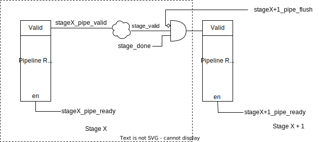

# RV32CoreF CPU Core Micro-architecture

[TOC]

## Introduction

RV32CoreF is a 32 bit RISC-V CPU core supporting RV32I instruction set.

It follows the classic 5 stage pipeline architecture including:

- Instruction Fetch (IF)
- Instruction Decode (ID)
- Execution (EX)
- Memory (MEM)
- Write Back (WB)


## Pipeline

### Pipeline Control Signal

#### Pipeline handshake

In ordering to simply the pipeline control for stall,  we use the request/ready handshake protocol between the adjacent pipeline.

- `<stage>_pipe_req`: Indicate that the pipeline request to send data into the next pipeline stage.
- `<stage>_pipe_ready`: Indicate that the pipeline stage is ready to take the data from previous pipeline stage.

Status of handshaking signals:

| `<stageX>_pipe_req` | `<stageX+1>_pipe_ready` | comments                                                     |
| ------------------- | ----------------------- | ------------------------------------------------------------ |
| 0                   | 1                       | Pipeline Stalled from X+1 stage                              |
| 1                   | 1                       | Pipeline Stalled from X+1 stage                              |
| 0                   | 0                       | Insert a bubble to stage X + 1                               |
| 1                   | 0                       | Successful handshake. Valid data is transferred from stage X to stage X+1 |

#### Other pipeline control signal

- `<stage>_pipe_valid`: Indicate that this pipeline stage is valid. This is from the pipeline stage register.

- `<stage>_pipe_flush`: Indicate the the there is a request from previous stage to flush the current stage

- `<stage>_done`: Indicate the task on the pipeline stage is completed and can be moved to the next pipeline stage

- `<stage>_valid`: Indicate the the current pipeline stage is valid. This is a combination of `<stage>_pipe_valid`, exception generated in the current stage, and flush request from next stage.

#### Block Diagram



#### General logic for the control signal

```verilog
// Assuming s1 talks to s2:

// s1_valid: pipeline itself is valid and no flusing request from next stage
assign s1_valid = s1_pipe_valid & ~s2_pipe_flush & <exception invaliding current stage>;

// s1_done: task in s1 stage has completed
assign s1_done = <task in s1 has completed>;

// s1_pipe_ready: task in s1 stage has completed (s1_done) and next stage is ready
assign s1_pipe_ready = s2_pipe_ready & s2_done;

// s1_pipe_req: task in s1 stage has completed (s1_done) and stage itself is valid (s1_valid)
assign s1_pipe_req = s1_done & s1_valid;

// s1_pipe_flush: task in s1 reequest flusing or next stage request flusing
assign s1_pipe_flush = <task in s1 request flushing such as exception/branching etc.> | s2_pipe_flush;
```


### [TBD] Control Conflict

1. Pipeline stall due to memory access and interrupt want to flush the pipeline

   There will be an issue that if the data bus require that the request signal being asserted until the request has been accepted/completed. Then we can't flush the read/write instruction in the memory stage.

   To deal with this, let's carry the interrupt starting from the EX stage ??

2. If interrupt happens and we have a successful branch or jump instruction in the pipeline,

   then, what is the return address of the interrupt? It should be the target pc instead of PC + 4 of the branch instruction itself


## IF Stage

IF stage mainly contains the following logic

1. PC register and generation of the next PC value.

2. Generation of the control and address to access instruction RAM.

### Synchronous SRAM and pre-IF stage

in FPGA the RAM is usually implemented in Block RAM which is a type of synchronous SRAM. The Synchronous SRAM has one clock cycle latency for read operation which means that we are not able to get the read data at the same cycle as we send the read request.

So in our IF stage, if we send memory read request at clock cycle X, then the read data (instruction) is available in clock cycle X + 1.

In order to fix this issue, we have 2 potential solutions:

- Solution 1: Send the RAM read request at IF stage using current PC as address, then the instruction is available in ID stage. **In this design, the instruction read from Instruction RAM should NOT be flopped into the IF/ID pipeline stage registers, ID stage should directly consume the result from instruction RAM read data**
- Solution 2: Send the RAM read request while using next PC value as address, then the instruction is available in IF stage. 

Using solution introducing a imaginary stage before the IF stage whose PC value is next PC (usually PC + 4). We call this imaginary stage as pre-IF stage. It is imaginary because there is no stage pipeline for it. Or we can say the stage pipeline is PC register itself.

**In our CPU design, we use solution 2.**

### pre-IF and IF stage pipeline Control

With introduction of the SRAM bus (see ![SRAM Bus] session),  we need to consider the pipeline control signal for pre-IF stage and IF stage.

#### pipe_done signal

- For pre-IF stage, only when the bus accept the request, we are good to go, so `pre-IF_pipe_done = req & addr_ok `

- For IF stage, only when the bus return valid data then we can proceed to ID stage so `IF_pipe_done = data_ok`

#### pipe_ready signal

##### pre-IF to IF stage

For pre-IF stage, considering pre-IF_pipe_done and IF_pipe_ready, there are 4 possible situation:

| pre-IF_pipe_done | IF_pipe_ready | Comments                                                     |
| ---------------- | ------------- | ------------------------------------------------------------ |
| 0                | 0             | Bus is busy and has not taken the read request. Continue assert the bus request and wait for the bus to take the request |
| 0                | 1             | Bus is busy and has not taken the read request. Continue assert the bus request and wait for the bus to take the request |
| 1                | 1             | Bus is ready and take the read request, IF stage is also ready so we can go to IF stage to wait for the data |
| 1                | 0             | Bus is ready and take the read request, but IF stage is busy. This is complex case which needs more analysis |

For the 4th situation, there are 2 potential issues:

1. pre-IF can't assert req signal while waiting for IF_pipe_ready. This is because the data bus has already taken our request, if we assert the request again, then data bus will treat it as a new request. **So if data bus has accepted the request while pre-IF is not able to proceed, DO NOT send the request again in the next cycle.**
2. What should we do when the data bus returns the data but pre-IF is not able to proceed to IF stage? The data bus only provide the data for one cycle and we will lose the data.

There are two solutions:

1. Use additional register to save the data (instruction) coming back from pre-IF stage if IF stage is not able to take it due to ready signal being 0. When IF stage is ready, take the data from the register
2. Only send the memory read request when ID stage is able to accept the data (ready signal is high). This solution is simpler with some performance degradation.

We implemented both of the solution in our design. We provide a macro for user to select between the 2 solution: **CORE_PREIF_USE_SHADOW_REGISTER**

##### IF to ID stage

For IF stage, considering IF_pipe_done and ID_pipe_ready, similar to previous one, there are also 4 possible situation.

| IF_pipe_done | ID_pipe_ready | Comments                                                     |
| ------------ | ------------- | ------------------------------------------------------------ |
| 0            | 0             | Bus is busy and has not return the data. Continue to wait for the data. |
| 0            | 1             | Bus is busy and has not return the data. Continue to wait for the data. |
| 1            | 1             | Bus is ready and ID stage is able to take the data. We can proceed to ID stage |
| 1            | 0             | Bus is ready and ID stage is not able to take the data. This is complex case which needs more analysis |

For the 4th situation there is only one solution: Use additional register to save the data (instruction) coming back from IF stage if ID stage is not able to take it due to ready signal being 0. When ID stage is ready, take the data from the register.


## ID stage

ID stage contains instruction decoder (decoder.sv) and register file (regfile.sv).

In ID stage, the instruction is first decoded in decoder, then the register file is accessed to grep the rs1 and rs2 value for the downstream logic. The decoded control signals, immediate value, and rs1/rs2 value are send to the pipeline stage registers.

#### decoder (decoder.sv)

Decode the instruction to different control signals, and generate the immediate value.

We only detect illegal instruction detection on opcode. If other part of the instruction (such as funct3) is illegal, we don't detect that and the instruction might be treated as NOP depending on the encoding

#### register file (regfile.sv)

Hold the 32 register defined in RISC-V spec. Contains 2 read port for rs1/rs2 access in ID stage and 1 write port for register value write back from WB stage.

Register 0 (r0/zero) always read 0.


## EX stage

EX stage contains the following modules and functions

1. Arithmetic Logic Unit (ALU, alu.sv)
2. MUX to select different source for the ALU input
3. Branch/Jump control logic.
4. Data Memory Request Generation

#### Arithmetic Logic Unit (ALU, alu.sv)

ALU contains the logic for executing most of the arithmetic/logic operation in RISC-V ISA.

These are all the operations it does under RV32I Instruction Set (Floating point / Multiplication / Divide are implemented in separate logic unit if supported)

| Operation | Instruction                               |
| --------- | ----------------------------------------- |
| ADD       | AUIPC/LOAD/STORE/ADDI/ADD/JAL/JALR/Branch |
| SUB       | SUB/SLT/SLTU/SLTI/SLTIU                   |
| XOR       | XOR/XORI                                  |
| AND       | AND/ANDI                                  |
| OR        | OR/ORI                                    |
| SLL       | SLL/SLLI                                  |
| SRL       | SRL/SRLI                                  |
| SRA       | SRA/SRAI                                  |

#### MUX to select different source for the ALU input

ALU has 2 input signals, they can come from different sources depending on the instruction

Input Signal 1:

| Source       | Comments                                  |
| ------------ | ----------------------------------------- |
| register rs1 | R-type instruction/Store/Load/Branch/JALR |
| PC           | AUIPC/JAL/Branch                          |

Input Signal 2:

| Source       | Comments                                                |
| ------------ | ------------------------------------------------------- |
| register rs2 | R-type instruction                                      |
| Immediate    | I-type instruction/Store/Load/Branch/LUI/AUIPC/JAL/JALR |

#### Branch/Jump control logic

1. The branch/jump address calculation is performed in ALU.

2. We also need logic to check if branch are successful or not. To simplify the design, we reuse the ALU module to generate the result:

   1.  beq/bne: use ALU_OP_SUB opcode (doing subtruction) and check if the result is zero/not zero
   2. blt/bge: use ALU_OP_SLT opcode (doing SLT) and check if the result is zero/not zero
   3. bltu/bgeu: use ALU_OP_SLTU opcode (doing SLTU) and check if the result is zero/not zero

   We can tie all the other opcode to zero so that other logic will be optimized by synthesis tool

#### Data Memory Request Generation

1. The memory address calculation is performed in ALU.

2. Similar to IF stage, because we use synchronous RAM for data ram too, there are 1 read cycle latency. There are 2 options too:

   - Option 1: Send the request at EX stage, data will be available in MEM stage

   - Option 2: Send the request at MEM stage, data will be available in WB stage

​	**In our CPU design, we use option 1.**


#### Resource Reuse in ALU Design

We can reuse the same logic in ALU to save logic resource/gates or we can use dedicated logic for better performance and improve timing.

1. **ADD/SUB instruction** can use just one adder. For sub, use 2's complement to make it becomes add:

   ```
   a - b = a + (-b) = a + (~b+1)
   ```

2. **LOAD/STORE instruction** can use the Adder in ALU to calculate the address since *the effective address is obtained by adding register rs1 to the sign-extended 12-bit offset.* Offset is usually stored in immediate value so the address calculation is t**he same as ADDI instruction**.

3. **SLT/SLTU/SLTI/SLTIU** instruction. Instead of directly testing if a < b, we can use the sub result with some additional logic to determine if a < b.
4. **BEQ/BNE/BLT/BGE/BLTU/BGEU** instruction. We use the adder in ALU to calculate the target address.
5. **JAL/JALR** instruction. We use the adder in ALU to calculate the target address.


## MEM Stage

Data memory read data comes back at memory stage. Memory stage contains the logic to process the memory read data.


## WB Stage

Write back stage write the data back to the register.

There are several source of the write data:

| Source        | Comment                               |
| ------------- | ------------------------------------- |
| pc + 4        | From Jal/Jalr instruction             |
| ALU output    | From arithmetic and logic instruction |
| Memory output | From Load instruction                 |
| CSR output    | From CSR instruction                  |


## Exception and Interrupt


## SRAM Bus


## CPU Core Configuration

The following macro control different configuration to provide trade-off between complexity, performance and area. 

| Macro Name                     | Comment                                                      |
| ------------------------------ | ------------------------------------------------------------ |
| CORE_PREIF_USE_SHADOW_REGISTER | Use shadow register in pre-IF stage to hold instruction due to IF stall (IF_pipe_ready == 0) |
|                                |                                                              |
|                                |                                                              |
|                                |                                                              |


## Reference

1. CPU设计实战
   - The 5 stage pipeline architecture is base on the design in the above book
