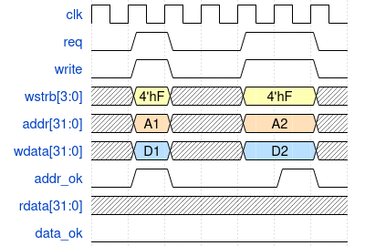
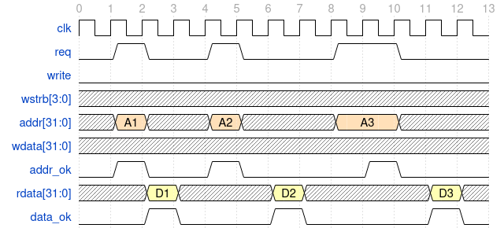

# RV32CoreF CPU Core Micro-architecture

[TOC]

## Introduction

RV32CoreF is a 32 bit RISC-V CPU core supporting RV32I instruction set. (More ISA to be added future)

It follows the classic 5 stage pipeline architecture including:

- Instruction Fetch (IF)
- Instruction Decode (ID)
- Execution (EX)
- Memory (MEM)
- Write Back (WB)

## Reference

1. CPU设计实战 - This CPU core architecture is mainly base on the design in the above book

## Pipeline

### Pipeline Control Signal


Assuming data flows from pipeline X to pipeline Y

#### Intra-pipeline control signal

- `x_done`: Indicate the task on the pipeline stage is completed and can be moved to the next pipeline stage
- `x_valid`: Indicate the the current pipeline stage is valid. This is a combination of `x_pipe_valid`, exception generated in the current stage, and flush request from next stage (`y_pipe_flush`).

- `x_req`: Indicate that the pipeline X request to send data into the pipeline stage Y.
- `x_flush`: (optional) Indicate that pipeline X generated a flush request

#### Inter-pipeline control signal

- `y_pipe_valid`: Indicate that the pipeline stage Y is valid. This is from the pipeline stage register.

- `y_pipe_ready`: Indicate that the pipeline stage Y is ready to take the data from previous pipeline stage X.
- `y_pipe_flush`: Indicate the the there is a request from stage Y to flush the stage X. This is implemented in combo logic.

In ordering to simply the pipeline control,  we use the request/ready handshake protocol between the adjacent pipeline. Status of handshaking signals:

| x_req` | `Y_pipe_ready` | comments                                                                |
| ------ | -------------- | ----------------------------------------------------------------------- |
| 0      | 1              | Pipeline Stalled from Y stage                                           |
| 1      | 1              | Pipeline Stalled from Y stage                                           |
| 0      | 0              | Insert a bubble to stage Y                                              |
| 1      | 0              | Successful handshake. Valid data is transferred from stage X to stage Y |

#### General logic for the control signal

```verilog
// Pipeline stage:
// X ==> Y

assign x_valid = x_pipe_valid & ~y_pipe_flush & ~exception;
assign x_done = <task in X has completed>;
assign x_req = x_done & x_valid;
assign x_flush = <task in X requests flushing>

assign x_pipe_ready = ~x_valid | x_req & y_pipe_ready;
assign x_pipe_flush = x_flush | y_pipe_flush;

if (y_pipe_ready) y_pipe_valid <= x_req; // sequential logic
```

## IF Stage

IF stage mainly contains the following logic

1. PC register and generation of the next PC value.

2. Instruction RAM access control logic.

3. Logic to handle stall and flush request

### PC register and generation of the next PC value

PC stands for program counter, the value indicate the **address** of the current instruction being executed

IF stage holds the PC register. In each clock cycle PC increment itself by 4 pointing to the next instruction in the memory.

PC value can be altered by jump/successful branch instruction or exception/interrupt handling logic.

### Instruction RAM access control logic

IF stage is responsible for generate the address and control signal to access instruction ram.

#### Instruction fetch with Synchronous SRAM

In FPGA the RAM is usually implemented in Block RAM which is a type of synchronous SRAM.

The Synchronous SRAM has one clock cycle latency for read operation meaning that the read data will be available in the next clock cycle after asserting read request. This means we will need at least 2 cycle to complete instruction fetch.

In order to be able to fetch an instruction on every clock cycle, there 2 potential solutions:

- Solution 1: Send the RAM read request using current PC as address, and the instruction will be available in ID stage. **In this design, the instruction read from Instruction RAM should NOT be flopped into the IF/ID pipeline stage registers, ID stage should directly consume the result from instruction RAM read data**
- Solution 2: Send the RAM read request using next PC value as address, then the instruction is available in IF stage. Because sending memory read request is one clock cycle before getting the instruction, we can call it as "pre-IF" stage.

**In our CPU architecture, we use solution #2.**

## ID stage

ID stage contains instruction decoder (decoder.sv), register file (regfile.sv), forwarding control and stall control.

In ID stage, the instruction is first decoded in decoder, then the register file is accessed to get the rs1 and rs2 value for the instruction. The decoded control signals, immediate value, and rs1/rs2 value are sent to the pipeline stage registers.

### decoder (decoder.sv)

Decode the instruction to different control signals, and generate the immediate value.

### register file (regfile.sv)

Register file hold the 32 registers defined in RISC-V spec. It contains 2 read port for rs1/rs2 access in ID stage, and 1 write port for register value write back from WB stage.

Register 0 (r0/zero) always read 0 and is hard coded to zero.

### Forwarding Control

For RAW (read-after-write) hazard, we use forwarding logic to forward the  rd write data from EX (output of ALU), MEM (output of ALU/MEM MUX), and WB stage to ID stage.

The reason of forwarding the data to ID stage is that all the data can be merged in ID stage. If we forward to EX stage, then we still need one forward path from WB to ID stage if instruction in ID stage depends on WB stage.

### Stall Control

For load instruction, data will be available only in MEM stage. If the instruction that is immediately after the load instruction depends on the load instruction, it won't be able to get the data in ID stage. In this case, we need to stall the pipeline stage and keep the instruction in ID stage till the data is available in MEM stage

## EX stage

EX stage contains the following modules and functions

1. Arithmetic Logic Unit (ALU, alu.sv)
2. Branch/Jump control logic.
3. Data Memory Request Generation

### Arithmetic Logic Unit (ALU, alu.sv)

ALU contains the logic for executing most of the arithmetic/logic operation in RISC-V ISA.

These are all the operations it does under RV32I Instruction Set (Floating point / Multiplication / Divide are implemented in separate logic unit if supported)

| Operation | Instruction                                   |
| --------- | --------------------------------------------- |
| ADD       | AUIPC/LUI/LOAD/STORE/ADDI/ADD/JAL/JALR/Branch |
| SUB       | SUB                                           |
| SLT       | SLT                                           |
| SLTU      | SLTU                                          |
| XOR       | XOR/XORI                                      |
| AND       | AND/ANDI                                      |
| OR        | OR/ORI                                        |
| SLL       | SLL/SLLI                                      |
| SRL       | SRL/SRLI                                      |
| SRA       | SRA/SRAI                                      |

#### Resource Reuse in ALU Design

We can reuse the same logic in ALU to save logic resource/gates or we can use dedicated logic for better performance and improve timing.

1. **ADD/SUB instruction** can share one adder. For sub, use 2's complement to make it becomes add:

   ```text
   a - b = a + (-b) = a + (~b+1)
   ```

2. **LOAD/STORE instruction** can use the Adder in ALU to calculate the address since *the effective address is obtained by adding register rs1 to the sign-extended 12-bit offset.* Offset is usually stored in immediate value so the address calculation is t**he same as ADDI instruction**.

3. **SLT/SLTU/SLTI/SLTIU** instruction. Instead of directly testing if a < b, we can use the sub result with some additional logic to determine if a < b.

4. **BEQ/BNE/BLT/BGE/BLTU/BGEU** instruction. We use the adder in ALU to calculate the target address.

5. **JAL/JALR** instruction. We use the adder in ALU to calculate the target address.

#### MUX to select different source for the ALU input (in EX stage)

ALU has 2 input signals, they come from different sources depending on the instruction

Input Signal 1:

| Source       | Comments                                  |
| ------------ | ----------------------------------------- |
| register rs1 | R-type instruction/Store/Load/Branch/JALR |
| PC           | AUIPC/JAL/Branch                          |
| 0            | LUI                                       |

Input Signal 2:

| Source       | Comments                                                |
| ------------ | ------------------------------------------------------- |
| register rs2 | R-type instruction                                      |
| Immediate    | I-type instruction/Store/Load/Branch/LUI/AUIPC/JAL/JALR |

#### MUX after output of ALU (in EX stage)

For JAL/JALR instruction, PC + 4 is written into rd. Because ALU is used to calculate the address, an additional adder is used to calculate PC + 4. A MUX is used to select between ALU output and PC+4 output as the final ALU output for rd write data.

### Branch/Jump control logic

The branch/jump address calculation is performed in ALU.

We also need logic to check if branch are successful or not. We can't use ALU because ALU is used to calculate the branch address. We will need additional logic to perform equal/not equal, less then/greater or equal (both signed and unsigned) checks.

To simplify the design, we reuse the ALU module to generate the comparsion result:

1. For beq/bne: use ALU_OP_SUB opcode (doing subtruction) and check if the result is zero/not zero
2. For blt/bge: use ALU_OP_SLT opcode (doing SLT) and check if the result is zero/not zero
3. For bltu/bgeu: use ALU_OP_SLTU opcode (doing SLTU) and check if the result is zero/not zero

We set the opcode depending on the branch type and tie off  all the other opcodes. Synthesis tool will optimize the logic and removed all the unused logic.

### Data Memory Request Generation

The memory address calculation is performed in ALU.

Similar to IF stage, synchronous RAM is used as data ram so we need at least 2 cycles to get the read data. There are 2 stages where we can start the memory access request.

- Option 1: Send the request at EX stage, data will be available in MEM stage

- Option 2: Send the request at MEM stage, data will be available in WB stage

**In our CPU design, we use option 1.**

## MEM Stage

Data memory read data comes back at memory stage. Memory stage contains the logic to process the memory read data (sign/unsigned extension to XLEN width depending on read type)

## WB Stage

Write back stage write the data back to the register. It also contains the CSR register module (see CSR session) and Trap Controller (see Exception and Interrupt session)

There are several source of the register write data:

| Source        | Comment                                                                      |
| ------------- | ---------------------------------------------------------------------------- |
| PC + 4        | From Jal/Jalr instruction, merged with ALU output at EX stage                |
| ALU output    | From arithmetic and logic instruction, merged with PC + 4 output at EX stage |
| Memory output | From Load instruction, merged with the result from EX stage at MEM stage     |
| CSR output    | From CSR instruction, merged with the result from MEM stage at WB stage      |

## Exception and Interrupt

All the exception are handled as precise exception and processed at WB stage. All the exception generated along the path are store in the pipeline register and passed to the next stage.

Interrupt is also treated as precise exception, and it will be handled similarly as precise exception. We log the interrupt at ID stage and pass the interrupt information from ID stage eventually to WB stage. **However, interrupt can only be logged at ID stage when ID stage is valid.** This is because this instruction will be flushed when it (and interrupt) enter WB stage and be executed when interrupt exit. (This is related to how the precise exception is handled). If the instruction in ID is not a valid instruction (bubble), then we don't know where the continue the execution.

A pipeline stage will be invalidated if there are exception/interrupt in its downstream pipeline stage. For example, if MEM stage has an exception/interrupt, then IF/ID/EX stage will be invalidate. This will prevent the instruction commit to critical units (such as write memory) since the instruction will eventually be flushed out when exception/interrupt reach the WB stage.

### Trap controller

A trap controller is used to process the exception and interrupt. As mentioned above it is located in WB stage.

## SRAM Bus

In SOC, we are planning to use AXI-lite bus as the interconnection bus so we introduce a SRAM bus as the bus interface to access the memory.

The SRAM bus is similar to a generic memory bus interface with few additional control signal added to ease the connection to the AXI-lite bus.

We introduce the SRAM bus first because the pipeline control signal depends on the addr_ok and data_ok in the SRAM bus.

### SRAM Bus signal

| Signal Name | Direction | Width | Description                                                             |
| ----------- | --------- | ----- | ----------------------------------------------------------------------- |
| req         | output    | 1     | **Request.** Indicate that there is a transaction request.              |
| write       | output    | 1     | **Write/Read.** 1 - write request. 0 - read request.                    |
| **wstrb**   | output    | BW    | **write strobe.** Byte enable for write request.                        |
| addr        | output    | AW    | **Address.** Address of the transaction.                                |
| wdata       | output    | DW    | **Write data.**                                                         |
| **addr_ok** | input     | 1     | **Address OK.** When asserted, indicate the target accepts this request |
| rdata       | input     | DW    | **Read data.**                                                          |
| **data_ok** | input     | 1     | **Data OK.** When asserted, indicate the target returns the read data   |

BW: Number of bytes

DW: Data width

AW: Address width

### SRAM Bus timing diagram

1. Write request without/with wait state



2. Read without/with wait state on both address and data



### SRAM Bus impact on IF stage pipeline control

### pre-IF and IF stage pipeline Control

With introduction of the SRAM bus (see ![SRAM Bus] session),  we need to consider the pipeline control signal for pre-IF stage and IF stage.

#### pipe_done signal

- For pre-IF stage, only when the bus accept the request, we are good to go, so `pre-IF_pipe_done = req & addr_ok `

- For IF stage, only when the bus return valid data then we can proceed to ID stage so `IF_pipe_done = data_ok`

#### pipe_ready signal

##### pre-IF to IF stage

For pre-IF stage, considering pre-IF_pipe_done and IF_pipe_ready, there are 4 possible situation:

| pre-IF_pipe_done | IF_pipe_ready | Comments                                                                                                                 |
| ---------------- | ------------- | ------------------------------------------------------------------------------------------------------------------------ |
| 0                | 0             | Bus is busy and has not taken the read request. Continue assert the bus request and wait for the bus to take the request |
| 0                | 1             | Bus is busy and has not taken the read request. Continue assert the bus request and wait for the bus to take the request |
| 1                | 1             | Bus is ready and take the read request, IF stage is also ready so we can go to IF stage to wait for the data             |
| 1                | 0             | Bus is ready and take the read request, but IF stage is busy. This is complex case which needs more analysis             |

For the 4th situation, there are 2 potential issues:

1. pre-IF can't assert req signal while waiting for IF_pipe_ready. This is because the data bus has already taken our request, if we assert the request again, then data bus will treat it as a new request. **So if data bus has accepted the request while pre-IF is not able to proceed, DO NOT send the request again in the next cycle.**
2. What should we do when the data bus returns the data but pre-IF is not able to proceed to IF stage? The data bus only provide the data for one cycle and we will lose the data.

There are two solutions:

1. Use additional register to save the data (instruction) coming back from pre-IF stage if IF stage is not able to take it due to ready signal being 0. When IF stage is ready, take the data from the register
2. Only send the memory read request when ID stage is able to accept the data (ready signal is high). This solution is simpler with some performance degradation.

We implemented both of the solution in our design. We provide a macro for user to select between the 2 solution: **CORE_PREIF_USE_SHADOW_REGISTER**

##### IF to ID stage

For IF stage, considering IF_pipe_done and ID_pipe_ready, similar to previous one, there are also 4 possible situation.

| IF_pipe_done | ID_pipe_ready | Comments                                                                                               |
| ------------ | ------------- | ------------------------------------------------------------------------------------------------------ |
| 0            | 0             | Bus is busy and has not return the data. Continue to wait for the data.                                |
| 0            | 1             | Bus is busy and has not return the data. Continue to wait for the data.                                |
| 1            | 1             | Bus is ready and ID stage is able to take the data. We can proceed to ID stage                         |
| 1            | 0             | Bus is ready and ID stage is not able to take the data. This is complex case which needs more analysis |

For the 4th situation there is only one solution: Use additional register to save the data (instruction) coming back from IF stage if ID stage is not able to take it due to ready signal being 0. When ID stage is ready, take the data from the register.
